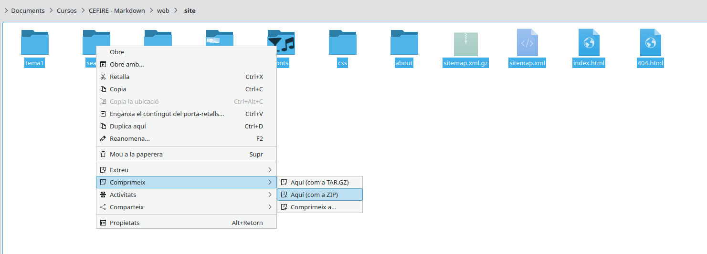
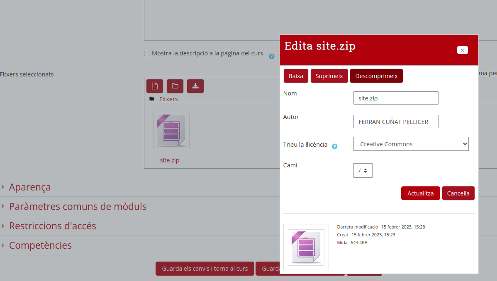
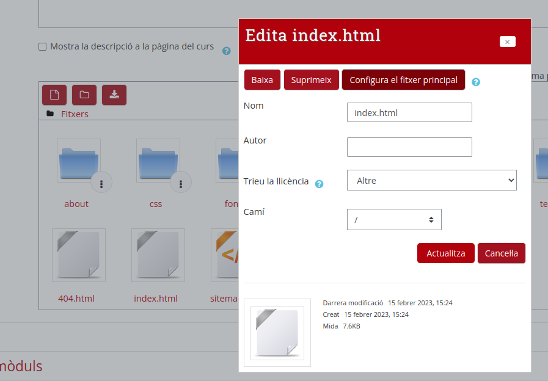
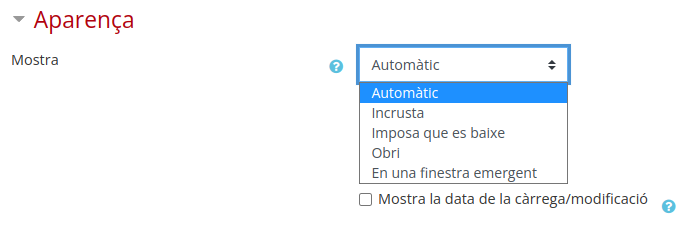

## 1. Allotgem la nostra web al servidor d'Aules

En l'apartat anterior hem vist com construir la nostra web. Ara podem allotjar els nostres arxius per a que es mostres en forma de web a Aules.

Per allotjar la nostra web a Aules, hauriem de seguir els següents passos:

1. Comprimim tot el contingut de la cvarpeta *site* en un arxiu .zip.
    
2. Creem un recurs de tipus *Fitxer* a aules i afegim el zip.
    
3.  Descomprimim el zip una vegada pujat.
    
4.  Fem clic sobre l'arxiu index.html (o l'arxiu arrel del teu lloc si has canviat el nom a l'arxiu md principal) i el definim com a fitxer principal.
    
5.  Per últim definim com volem que es veja:
    1.  Automàtic - Se selecciona de forma automàtica la millor opció per visualitzar el tipus de fitxer. En este cas l'incrustarà.
    2.  Incrustat - El fitxer es mostra dins d'Aules.
    3.  Imposa que es baixe - Se li demana descarregar el fitxer a l'usuari. No utilitzar.
    4.  Obri - Es mostra la web a la finestra actual del navegador.
    5.  Finestra emergent - El fitxer es mostra en una finestra nova del navegador sense menús ni barres d'adreces.

    