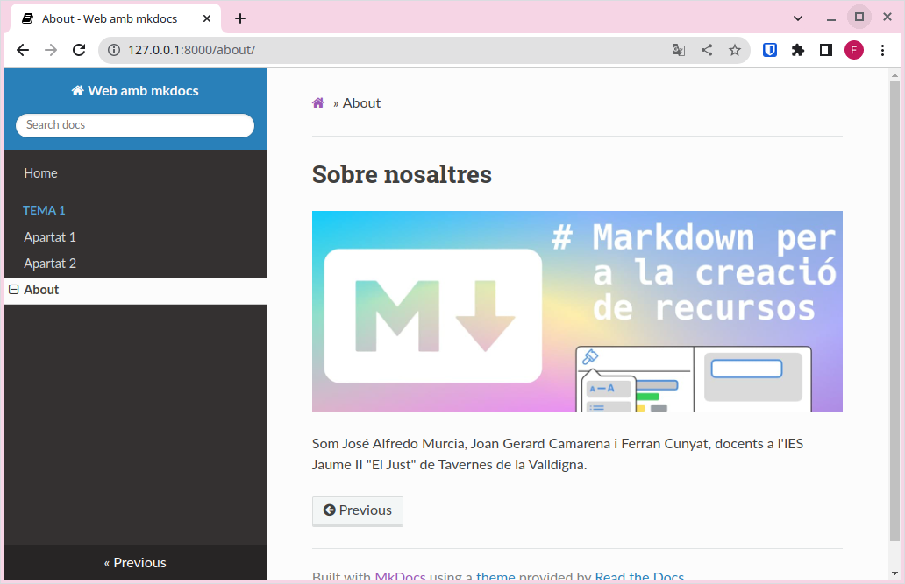
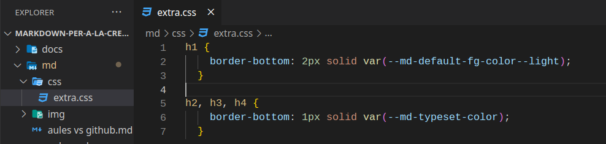
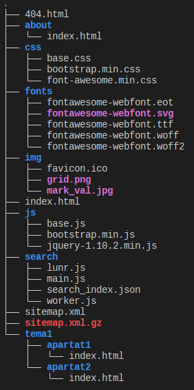

## 1. Configuració

### 1.1. Modifiquem l'arxiu *mkdocs.yml*

Tant l'mkdocs com el tema que escolliu tenen moltes possibilitats, però ací veurem la configuració bàsica. Si voleu configurar o personalitzar alguna cosa, haureu de consultar la documentació d'mkdocs o del tema segons el cas.

En este enllaç està la documentació de la configuració d'mkdocs [https://www.mkdocs.org/user-guide/configuration/](https://www.mkdocs.org/user-guide/configuration/).

#### 1.1.1. site_name

L'única configuració que és necessària per a servir la web és el *site_name*, que serà una cadena de text que definirà el títol de la pestanya del navegador i apareixerà en el menú de navegació. Diriem que és el nom que defineix la nostra web, per tant serà la primera configuració que modificarem.

Per exemple, en el cas d'esta web, hem posat com a *site_name: Web estàtica amb mkdocs*

#### 1.1.2. docs_dir

Amb la directiva site_dir, configurem en quina carpeta tenim els arxius font, és a dir el contingut en format markdown a partir del qual es generarà la web.

!!!note "docs_dir"
    De moment podem deixar sense configurar el docs_dir, però serà necessari en apartats posteriors.

#### 1.1.3. site_dir

Amb la directiva site_dir, configurem en quina carpeta volem que ens deixe la web llesta per a publicar.

!!!note "site_dir"
    De moment podem deixar sense configurar el site_dir, però serà necessari en apartats posteriors.

### 1.2. Pàgines

Anem a veure en este apartat com configurar noves pàgines a la nostra web. Seran accessibles a través del menú de navegació.

El primer pas serà incorporar un nou arxiu .md amb contingut, per exemple, about.md a la carpeta docs.

Després modificarem l'arxiu de configuració per afegir al menú de navegació les nostres pàgines de la forma següent:

```yaml
nav:
    - Home: index.md
    - About: about.md
```
Ara la pàgina tindrà l'aspecte següent:


Pots observar que al menú de navegació ara tenim les opcions Home i About i també ens han aparegut unes fletxes de *Previous* i *Next* per poder navegar a través d'elles.

Es poden crear submenús al menú de navegació, configurant el *mkdocs.yml*:

```yaml
nav:
    - Home: index.md
    - Tema 1:
      - Apartat 1: tema1/apartat1.md
      - Apartat 2: tema1/apartat2.md
    - About: about.md
```


#### 1.2.1. Seccions dins les pàgines

Per defecte, una pàgina web sols hauria de contenir un encapçalament de primer ordre, és a dir una etiquet h1 en html o un # en markdown. Per tant, recomanem que les seccions dins una pàgina es comencen a numerar amb ##:

```markdown
## 1

### 1.1

#### 1.1.1

#### 1.1.2

### 1.2

## 2

### 2.1

```

### 1.3. Buscador

Observeu que també disposem d'un buscador al menú de navegació que ens permetrà buscar a través del contingut de la web. 

!!!note "Buscador" 
    Açò pot ser molt útil per als nostres alumnes a l'hora d'utilitzar els nostres recursos com a documentació de referència. Els permetrà localitzar ràpidament el contingut que busuqen.

    Observeu que ens trobarà totes les ocurrències del contingut buscat.

### 1.4. Tema

Fins ara, hem utilitzat el tema per defecte per a renderitzar la pàgina, però existeixen altres temes per canviar l'aspecte a la nostra web, sense haver de canviar res al nostre contingut.

Per canviar el tema, editem l'arxiu de configuració i afegim una línia com la següent:

```yaml
theme: readthedocs
```
En guardar l'arxiu, l'aspecte haurà canviat:

<figure markdown>
  
  <figcaption>Tema readthedocs</figcaption>
</figure>

<figure markdown>
  
  <figcaption>Tema mkdocs</figcaption>
</figure>

<figure markdown>
  
  <figcaption>Tema material</figcaption>
</figure>

!!!note "Temes per defecte"
    Mkdocs sols incorpora dos temes, mkdocs i readthedocs, però hi ha temes desenvolupats per tercers que podeu utilitzar. Simplement s'hauria de mirar a la documentació corresponent com posar-los en funcionament. Sol ser un procés molt senzill. 

    Al següent enllaç tens informació sobre altres temes per a mkdocs, [https://github.com/mkdocs/mkdocs/wiki/MkDocs-Themes](https://github.com/mkdocs/mkdocs/wiki/MkDocs-Themes).

!!!note "Material for mkdocs"
    Un tema molt complet, amigable i versàtil és material for mkdocs. Consulteu la documentació en cas de voler-lo utilitzar. 
    
    Per instal·lar-lo executeu `pip install mkdocs-material`.

    Per utilitzar-lo `theme: material`.

    [https://squidfunk.github.io/mkdocs-material/](https://squidfunk.github.io/mkdocs-material/)

#### 1.4.1. Modifiquem el tema

Per modificar el tema, creem un arxiu amb les regles css que vulem modificar i el situem a la carpeta on tenim els arxius font (*docs_dir*). A l'mkdocs el referenciem amb l'opció "extra_css".

Per exemple:



Arxiu mkdocs.yml (no està complet):

```yaml
docs_dir: "md"
site_dir: "docs"

...
extra_css:
  - css/extra.css
```

Ara al fer un *build* observarem que els arxius de regles css es copien la carpeta a la carpeta del *site_dir* i també que s'apliquen els canvis en servir en local el lloc.


### 1.5. Canviant l'icona de la nostra web

Per defecte, mkdocs utilitza la seua propia icona. Si volem utilitzar una icona diferent, crea un directori img a la carpeta docs i guarda una icona amb el nom favicon.ico, mkdocs el detectarà i el canviarà automàticament.

### 1.6. Afegint *admonitions* (caixes de l'estil awesomebox)

Per poder fer ús de les caixes per resaltar contingut, hem d'afegir el plugin admonition a l'arxiu de configuració:

```yaml
markdown_extensions:
  - admonition
```

A diferència d'awesomebox, les caixes a mkdocs es defineixen amb tres tancaments d'exclamació, i el contingut de dins la caixa va tabulat. Per exemple:

```markdown
!!!note "Anotació"
    Esta part si que la podeu provar a casa.

!!!warning "Compte!"
    Aneu amb compte al realitzar esta part.

!!!danger "Perill!!"
    No proveu açò a casa.
```

!!!note "Anotació"
    Esta part si que la podeu provar a casa.

!!!warning "Compte!"
    Aneu amb compte al realitzar esta part.

!!!danger "Perill!!"
    No proveu açò a casa.

### 1.7. Construim el lloc web

Finalment, després d'haver comprovat al nostre ordinador que el resultat és l'esperat, construïm el lloc web, és a dir, el deixem enllestit per poder-lo penjar a un servidor amb l'ordre:

```sh
mkdocs build
```

Veuràs que es crea una carpeta *site* amb l'estructura següent:



Esta carpeta conté tots els arxius necessaris per servir la web, i és la carpeta que publiquen els servidors per a accedir a les seues respectives webs.

## 2. Resum

1. Instal·lem mkdocs.
2. Creem un nou projecte amb `mkdocs new "nom del projecte"`.
3. Servim el lloc en local i comprovem que tot va funcionant i es visualitza com desitgem amb `mkdocs serve`.
4. Afegim el contingut en arxius .md a la carpeta docs.
5. Enllacem els diferents arxius al menú de navegació modificant l'arxiu mkdocs.yml.
6. Configurem el tema, el nom del lloc i la resta de configuracions que vulguem utilitzar.
7. Construim el lloc amb `mkdocs build`.