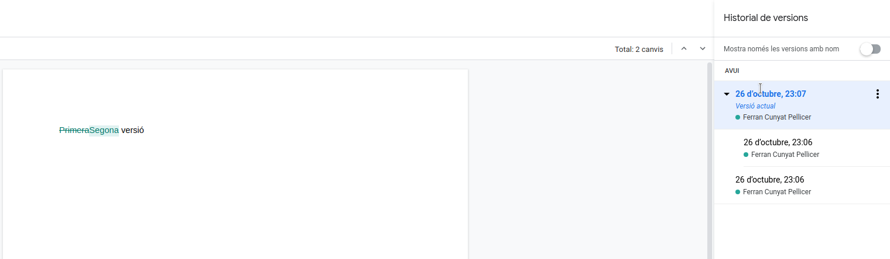
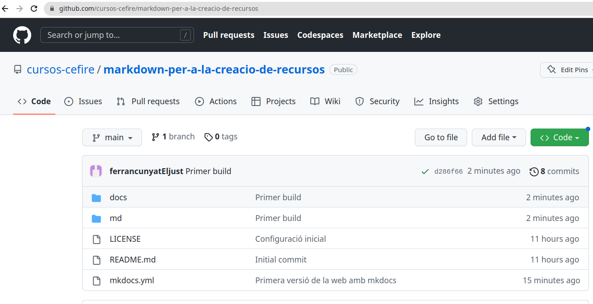

## 1. Allotgem la nostra web al servidor de github

### 1.1. Què és un sistema de control de versions?

Per a entendre què és Github, necessitem conéixer dos conceptes relacionats:

- Sistema de control de versions
- Git

Un *sistema de control de versions* ajuda els desenvolupadors de contingut a rastrejar i gestionar els canvis que es produeixen en un projecte. És àmpliament utilitzat en el desenvolupament de *software*, però el podem aplicar a altres àmbits, com l'àmbit docent, per a gestionar els nostres apunts. 

Anem a veure un exemple ...

Imaginem que som desenvolupadors que col·laborem en el desenvolupament de [WordPress](https://wordpress.com/es/). Si un dels desenvolupadors volgués treballar en una de les parts del codi de WordPress, no seria segur ni eficaç que editara directament el codi font "oficial".

En lloc d'això, el control de versions permet als desenvolupadors treballar amb seguretat mitjançant *ramificacions* i *fusions*.

Amb la ramificació, un desenvolupador duplica el codi font (anomenat repositori) al seu ordinador. Aleshores, el desenvolupador pot fer canvis en aquesta part del codi sense afectar la resta del projecte.

Una vegada el desenvolupador ha provat i aconsegueix que la seua part del codi funcione correctament, pot incloure els seus canvis al projecte, és a dir, fusionar aquest codi amb el codi font principal per fer-lo oficial.

El *sistema de control*, ens permet aleshores veure quins canvis s'han produït, revertir-los, incloure'ls, tornar a una versió anterior...

Un altre exemple de control de versions el podem observar en els documents de Google Suite. Per veure les diferents versions que tenim d'un document, podem accedir fent clic a l'enllaç on indica quan s'ha guardat la *última* modificació que hem fet al document.


Ens apareix una finestra on tenim les diferents versions que s'han anat guardant del document. També podem veure, en verd, què s'ha inclós al document des de les anteriors versions o què s'ha eliminat, esta vegada en verd però amb el text ratllat.



VSCode també incorpora control de versions als nostres arxius, de forma que podem tornar a una versió anterior en el temps. Per fer-ho, pulsem baix a la dreta *TIMELINE* o *LÍNIA DE TEMPS* segons l'idioma i veurem les versions anteriorment guardades de forma automàtica. Si fem clic sobre qualsevol de les versions, podrem veure els canvis respecte a la versió actual i escollir la que més ens interesse.


#### 1.1.1. Git

Git és un sistema de control de versions de codi obert creat per Linus Torvalds, el creador del primer kernel de Linux, l'any 2005.

Es diu que Git és un sistema de control de versions distribuït, ja que totes les versions estan disponibles a l'ordinador de cada desenvolupador, cosa que permet ramificar i fusionar molt fàcilment.

Segons una enquesta de desenvolupadors de Stack Overflow, més del 87% dels desenvolupadors utilitzen Git.

### 1.2. Aleshores, què és [Github](https://github.com/)?

GitHub és una plataforma que ofereix un servei gratuït d'allotjament de repositoris Git basat en el núvol. En altres paraules, és una forma d'utilitzar repositoris Git a través de la web.

La interfície de GitHub és molt intuïtiva i fàcil d'utilitzar, i elimina la necessitat d'utilitzar la línia de comandaments per a dur el control de versions. És tan fàcil d'utilitzar, que ha adquirit molta popularitat per a gestionar altres tipus de projectes, com ara escriure llibres, apunts...

Els repositoris que creem a Github poden ser públics i estar disponibles per a qualsevol persona o ser privats, però en aquest cas només seran accessibles pels col·laboradors del repositori.

!!!note "Github"
    Github va entrar en funcionament l'any 2008. 

    L'any 2018, Microsoft el va adquirir per 7.500 milions de dòlars.

    En Gener del 2020, GitHub tenia més de 40 milions d'usuaris, més de 190 milions de repositoris, 28 milions dels quals són públics.


## 2. Configuració de Github

### 2.1. Registre d'usuari

En este primer punt, crearem un repositori github per a allotjar la nostra web. 

El primer pas serà registrar-nos a github en cas que no ho estigam ja accedint al següent enllaç [https://github.com/signup?user_email=&source=form-home-signup](https://github.com/signup?user_email=&source=form-home-signup).

!!!warning "Registre"
    Fixeu-se que el registre es realitza a través d'un formulari completament integrat en la web amb una estètica molt cuidada


### 2.2. Creació d'un repositori

Un repositori de github és un projecte allotjat al núvol sobre el qual volem portar un control de versions a través de la web.

!!!warning "Repositori github en local"
    Un repositori també el podem clonar al nostre disc dur per treballar de forma local, i solament enviar els canvis definitius per a la seua publicació. VSCode ens proporciona facilitats per treballar amb repositoris de github. Recomanem utilitzar esta forma de treballar.

Per a crear un repositori, iniciem sessió a [https://github.com](https://github.com) i fem clic al botó de `+` de dalt a la dreta, després seleccionem l'opció de `New repository`. 


Assigneu un nom que identifique el repositori i el feu públic. Si voleu, també podeu afegir un arxiu `README` i una llicència.


### 2.3. Clonació del repositori

El que anem a fer ara és portar el repositori de Github al nostre ordinador per a poder agregar contingut, que una vegada provat, tornarem a pujar a Github per a que es publique la nostra web, igual que hem fet a Aules. 

Per a portar el codi hem de clonar el repositori al nostre disc dur. Utilitzarem la pestanya de control de versions que incorpora el Visual Studio Code per a fer-ho.


Ens demanarà el repositori a clonar, ahí peguem la URL del nostre repositori. La podem obtindre del nostre repositori d'una de les dues següents formes, depenent si està completament buit o si ja conté algun arxiu (README.md i LICENSE).


Clonació de repositori buit


Clonació de repositori amb contingut


!!!important "Git"
    En cas de no tindre git instal·lat, l'opció de clonar el repositori ens apareixerà deshabilitada. 

Es pot instal·lar amb **sudo apt install git** en sistemes basats en Debian.  

En sistemes Windows podeu visitar el següent [enllaç](https://github.com/git-for-windows/git/releases/) i baixar l'última versió (Git-2.39.2-64-bit.exe en el moment d'escriure estos apunts).

Si el repositori s'ha clonat correctament, tindreu una carpeta amb el mateix nom del repositori a l'ubicació on l'heu clonat. Si contenia arxius, estaran dins la carpeta.

### 2.4. Configurem el projecte d'mkdocs per a publicar a github

Ara, haurem de crear un projecte d'mkdocs dins la carpeta del repositori o copiar el repositori creat anteriorment.

!!!warning "mkdocs new"
    En l'apartat de crear un nou projecte amb mkdocs, es va explicar que l'ordre és `mkdocs new "nom del projecte"`. 
    
    Però si ja tens clonada la carpeta de github, **hauràs d'executar `mkdocs new "nom carpeta github"`** per a que no et cree una nova carpeta dins el projecte, sinó utilitzar la mateixa que github.

!!!important "Carpeta docs i site"
    Per defecte, els arxius markdown en un projecte mkdocs estan a la carpeta `docs`, mentre que la web es construeix a la carpeta `site`. Però github sols pot publicar webs que s'allotgen a l'arrel o a la carpeta `docs`. Per tant, els arxius del `build` han d'estar a l'arrel o a la carpeta docs.

    Per tant tenim dos possibles solucions:
    1. Executar el `mkdocs build` i copiar el contingut de la carpeta `site` a l'arrel del repositori (opció no recomanada).
    2. Modificar la configuració per a que els arxius font en markdown estiguen en una altra carpeta i que el resultat del build estiga a la carpeta docs (opció recomanada).

    La segona solució és la recomanada, ja que ens permetrà tindre en un mateix repositori de github els fonts en markdown i la web construida.

Per a configurar esta segona opció, simplement hem d'indicar a l'arxiu de configuració de mkdocs que els markdown estan en una altra carpeta i que la construcció vaja a la carpeta docs:

```yaml
docs_dir: 'md'
site_dir: 'docs'
```

Ara, haureu de situar els arxius en format .md a una carpeta md i deixar la carpeta docs buida.

En executar la construcció del site web amb `mkdocs build`, els arxius resultants es posaran a la carpeta docs.

### 2.5. Afegim arxius locals al repositori remot de github

Ara ens falta portar o publicar els canvis que hem fet al repositori local al repositori remot de github.

Si s'heu fixat a l'explorador del VSCode apareix la lletra U (*untracked*) a l'esquerra de cada arxiu. Això indica que eixe arxiu no està inclòs al repositori. Altres apareixeran amb la M si han sigut modificats després d'haver-los afegit (*modified*). 

Anem, en la pestanya de l'equerra, a *Source Control*, escrivim un missatge indicant quins canvis volem confirmar i li donem al botó de commit. En este cas, nosaltres hem posat "primera versió de la web amb mkdocs".


Ens ixirà una finestra preguntant si volem afegir i confirmar els canvis directament. Responem de forma afirmativa.

Per a evitar que ens fallen els commits, anem a configurar el nostre nom i el nostre correu a la configuració de Git, amb les següents dues ordres, introduint les vostres dades corresponents (el correu i el nom d'usuari són els utilitzats durant el registre de github):

```sh
git config --global user.email "El vostre correu"
git config --global user.name "El vostre nom d'usuari"
```

### 2.6. Pugem els canvis a Github

Una vegada confirmats els canvis al repositori, sols ens falta sincronitzar el remot amb els canvis del local.

Per fer-ho, simplement li donem al botó de sincronitzar, situat on abans estava el de `commit` a la pestanya del control de versions.


El VSCode ens avisarà de que l'extensió Github (ja ve integrada sense necessitat d'instal·lar-la) vol iniciar sessió a Github per a guardar els canvis que hem fet en local. Li donem a permetre i s'iniciarà l'intercanvi del *token* en diversos passos entre el navegador i el VSCode. A partir d'este moment VSCode podrà accedir de forma segura al repositori remot. Si no teniu la sessió iniciada a Github, se us demanarà l'usuari i la contrasenya durant el procés. 


Si tot ha anat bé, veureu en l'apartat de comptes d'usuari (icona de baix a l'esquerra) de VSCode que esteu amb la sessió de Github iniciada i el repositori local se n'haurà pujat a Github per a la seua publicació.


Podeu comprovar que els arxius que hem creat en local, estan al nostre respositori web de Github simplement accedint al repositori i observant si els arxius estan.



## 3. Configurem github per a que ens publique la web

Per últim, sols ens falta configurar github per a que ens publique el nostre *build*.

Aneu a *Settings* i en l'apartat **Pages** indiqueu que voleu publicar de la rama *main*, la carpeta *docs*.

En breu vos indicarà si la pàgina ja està publicada o si per contra hi ha hagut algun error. Si tot ha anat bé us indicarà l'adreça on s'ha publicat, que serà **https://nom_usuari.github.io/nom_repositori**. Comproveu que ja podeu navegar per ella i es veu tal qual la veieu al servidor local.

Esta web està publicada a [https://cursos-cefire.github.io/markdown-per-a-la-creacio-de-recursos/](https://cursos-cefire.github.io/markdown-per-a-la-creacio-de-recursos/) i el seu repositori corresponent amb tots els arxius font, arxiu de configuració i llicència el trobareu a [https://github.com/cursos-cefire/markdown-per-a-la-creacio-de-recursos/](https://github.com/cursos-cefire/markdown-per-a-la-creacio-de-recursos/).

!!!warning "Treball en local i en remot"
    Els arxius es poden modificar tant per web com en local, però recomanem fer-ho en local, ja que necessitem fer un build per a publicar els canvis. 

!!!warning "Construcció de la web"
    Recordeu executar un build abans de portar els canvis a publicar, d'altra forma, sols es publicaran els canvis als arxius font, però no a la web publicada. El procés de publicació sol tardar un parell de minuts en veures reflexat després de sincronitzar amb el remot.

!!!note "Ús de Source Control"
    Si esteu acostumats a treballar amb git i github, podeu executar els comandaments a través de git amb clone, add, commit i push. 