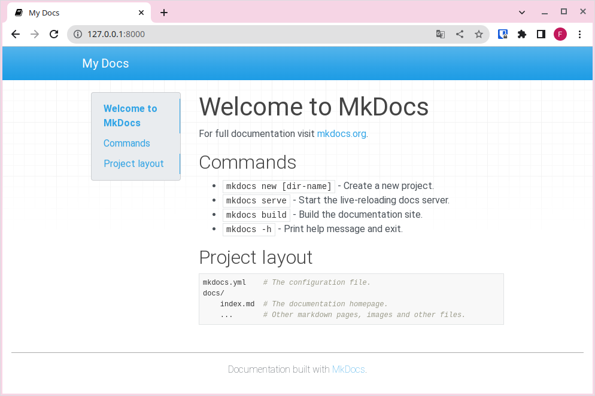

### 1. Instal·lació d'mkdocs

!!!info "VSCode"
    Per a realitzar estos passos, recomanem utilitzar VSCode, ja que ens permet tindre un editor d'arxius i una terminal oberta al mateix programa.

Els passos per realitzar la instal·lació s'han de realitzar des de la terminal (*Menu > Sistema > Konsole*).

!!! note "Usuaris de Windows"
    Si fem ús de Windows, caldrà que instal·leu python prèviament. Això ho farem descarregant-lo des de [https://www.python.org/](https://www.python.org/), i assegurant-nos durant la instal·lació que marquem l'opció *Add Python to PATH.*.

#### 1. **Creació d'un entorn virtual de python**

El primer que hem de fer és crear un entorn virtual de Python. Això ens servirà per disposar d'un entorn propi per instal·lar components en python sense interferir en els components del sistema. Per a això llançarem la següent ordre (l'escriurem a la terminal i posarem *Intro*):

```bash
sudo apt install python3-venv
```

Una vegada instal·lat el paquet `python3-venv`, que és el qui ens proporciona la capacitat de crear aquests entorns virtuals, anem a crear un entorn virtual per treballar amb *MkDocs*. 

Per a això, ens situem primer a la carpeta on instal·larem l'entorn. Per exemple en `~/.local`:

```bash
cd .local
```

I llancem l'ordre:

```
python3 -m venv mkdocsenv
```

!!! note "Usuaris de Windows"

    Amb windows llançarem:

    ```
    python -m venv mkdocsenv
    ```

#### 2. **Instal·lació dels paquets d'MkDocs amb `pip`.** 

Una vegada tenim creat l'entorn, l'hem d'activar, fent un `source` del fitxer d'activació:

```bash
source mkdocsenv/bin/activate
```

!!! note "Usuaris de Windows" 

    En Windows, haureu d'activar-lo llançant directament l'script:

    ```
    mkdocsenv\Scripts\activate
    ```

  Veurem com el *prompt* ara canvia indicant que estem dins l'entorn.

!!! warning "Important!"
    Recordeu que cada vegada que aneu a utilitzar mkdocs haureu d'activar aquest entorn!

Una vegada dins l'entorn, ja podem instal·lar mkdocs, com a llibreria de python, amb l'ordre:

```bash
pip install mkdocs
```

!!! info "Què és pip?"

    *Pip* (Package Installer for Pyton) és un sistema de gestió de programari propi de Python. Així com `apt` ens serveix per descarregar programari dels repositoris del sistema operatiu, `pip` ho fa des del repositori de programari Python.

Amb aquesta base, ja podrem fer ús d'mkdocs, i anar instal·lant altres components a mesura que els anem necessitant.


### 2. Creació d'un nou projecte

Una vegada tenim mkdocs instal·lat, necessitem crear un nou projecte per a construir la nostra web. Per tal de començar un nou projecte, executem:

```sh
mkdocs new "nom del projecte"
```

### 3. Estructura del projecte

Al crear un nou projecte, amb mkdocs, observareu que s'ha creat una estructura com la següent:

```
.
├── docs
│   └── index.md
└── mkdocs.yml
```

- L'arxiu **mkdocs.yml** és l'arxiu de configuració de tot el projecte.
- La carpeta **docs** contindrà els nostres documents en format markdown.
- L'arxiu **index.md** és un arxiu de mostra que es mostrarà en format web al accedir a l'arrel del lloc web.

Si et fixes, per una banda tindrem el contingut en markdown i per altra la configuració de com renderitzar aquest contingut.

!!!info "Carpeta docs"
    Encara que per defecte els arxius en format markdown estan a la carpeta docs, anem a canviar esta configuració en apartats posteriors.

### 4. Servim la web en local

Per a servir una web, necessitaríem un servidor web que ens allotjara la nostra web per tal de poder accedir de forma local o remota a través del navegador. mkdocs ens facilita aquesta tasca creant un servidor al nostre ordinador per tal que pugam previsualitzar els canvis abans de servir-ho en un servidor públic (accessible a través d'internet) o construir la nostra web per a publicar-la.

Per a servir la nostra web, simplement haurieu d'executar el següent comandament dins la carpeta del projecte (utilitzeu l'ordre cd per a navegar a ella):

```sh
$ mkdocs serve
INFO     -  Building documentation...
INFO     -  Cleaning site directory
INFO     -  Documentation built in 0.06 seconds
INFO     -  [12:49:32] Watching paths for changes: 'docs', 'mkdocs.yml'
INFO     -  [12:49:32] Serving on http://127.0.0.1:8000/
```

Ara accedirem a l'URL `http://127.0.0.1:8000/` i podrem veure la pàgina web per defecte:



!!!info "Index per defecte"
    Obriu al VSCode l'arxiu index.md i fixeu-vos com es correspon amb el que esteu veient a la web local. És a dir, s'està renderitzant el markdown en format web.

    Ara podeu introduir els canvis que desitgeu al vostre contingut, i en guardar, els canvis es reflectiran automàticament al navegador, sempre i quan, l'ordre mkdocs serve continue en execució. **La autorecàrrega es produeix sempre que modifiquem l'arxiu de configuració, el contingut dels arxius markdown o els arxius del tema.**

